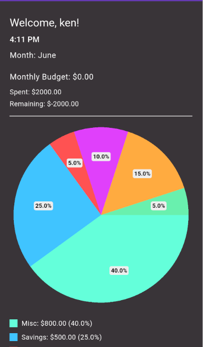
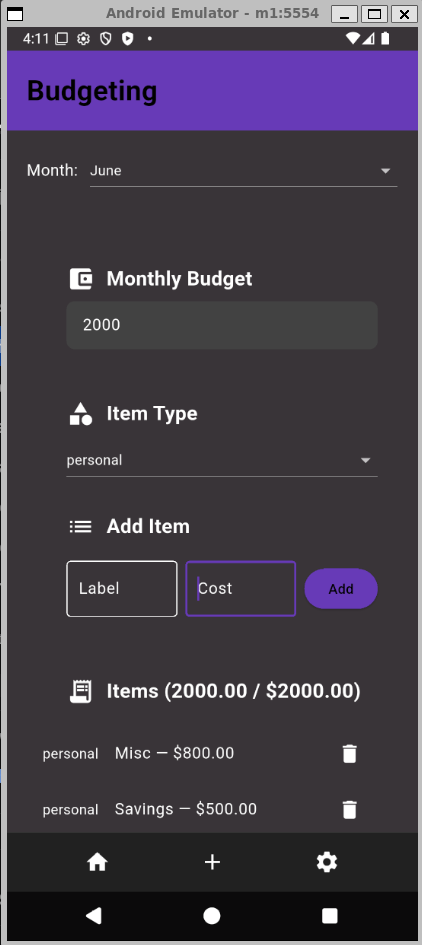
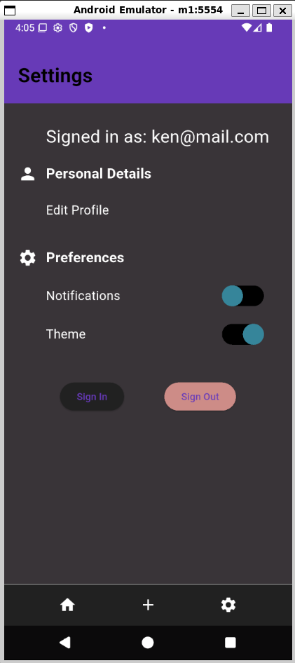
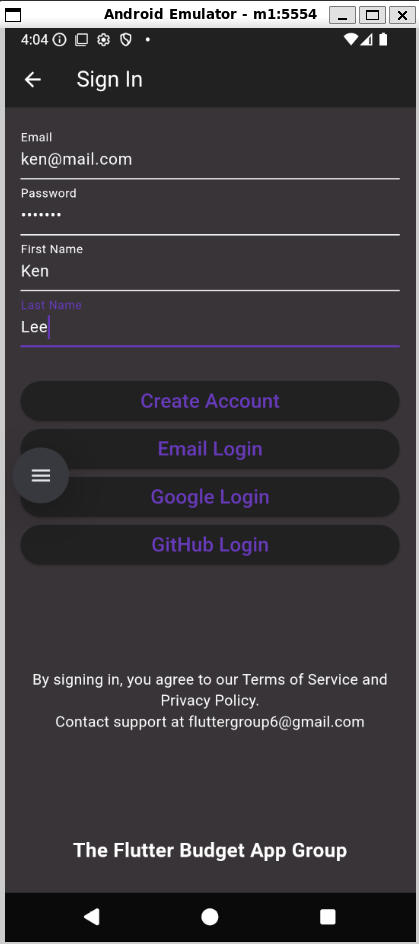

# Budget Manager - Flutter Mobile App

### Frontend:
    - Flutter
    - Dart
    - Firebase Authentication

### Backend (currently inactive): 
    - Shelf
    - PostgreSQL
    - Google Cloud 

Release Version of Android apk is in the root directory - 48Mb
<br>Minimum SDK version: Android API 23
<br>Run locally using an android emulator with Android Studio and FlutterSDK (or another Android Emulator):

```bash 
flutter emulators --launch <emulatorname>

flutter install --release ../app-release.apk

flutter run --release


# Android apk can be built using Flutter:
flutter build apk --release
```








